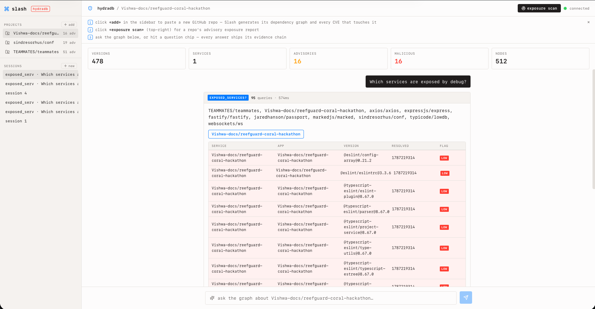
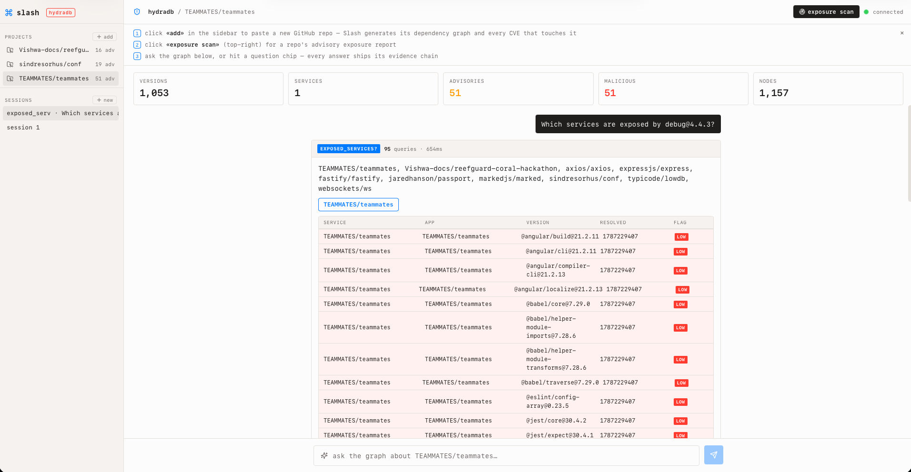

# Slash

> **Blast-radius intelligence for the software supply chain, computed natively in HydraDB.**

[](https://github.com/hydra-db/hydradb)
[](https://python.org)
[](https://github.com/hydra-db/hydradb)
[](LICENSE)

Slash ingests an npm-style package ecosystem into [HydraDB](https://github.com/hydra-db/hydradb) (a graph database on object storage) and answers, in real time, the questions a security team needs when a package is compromised at 09:00 and services are exposed by 09:06:

- Which internal services are **transitively exposed**?
- Which apps **resolved the bad version while it was live**?
- Which packages share **maintainers** or infrastructure with the compromised one?
- Which nearby names are likely **typosquats**?
- What is the **complete blast radius**?

Answers arrive with a **traceable evidence chain** — the exact Cypher query and subgraph that produced the result — and the system **abstains explicitly** when the data is not in the graph.

---

## 🎬 Product Demo & Walkthrough

### Walkthrough Video
https://github.com/user-attachments/assets/518e285d-0077-4581-80a5-fca600645063

<!-- Embedded video playback (GitHub rendered HTML5 video) -->
<video src="docs/screenshots/Screen%20Recording%202026-08-20%20at%208.31.44%E2%80%AFPM.mov" controls="controls" muted="muted" width="100%" style="border-radius: 8px; border: 1px solid #30363d;">
</video>

> 🎥 *If video does not auto-play in your browser, [click here to view / download the recording](docs/screenshots/Screen%20Recording%202026-08-20%20at%208.31.44%E2%80%AFPM.mov).*

---

### Product Screenshots

#### 1. Real-time Incident Exposure Scan & Advisory Correlation

*Slash Web Console showing real-time exposure scanning across live repos (`Vishwa-docs/reefguard-coral-hackathon`), mapping advisory ranges, affected versions, and transitive dependencies.*

#### 2. Deep Blast Radius & Service Provenance Traversal

*Multi-repo blast radius analysis against `TEAMMATES/teammates` (1,157 nodes, 1,053 versions, 51 advisories), isolating vulnerable resolution timestamps and transitive service blast radius.*

---

## Why a Graph Database

Blast radius is a **transitive reverse-dependency closure** over a graph of tens of millions of versioned nodes:
```
Compromised PackageVersion (e.g. debug@4.4.3)
      ▲
      │ (reverse DEPENDS_ON closure)
      │
Transitive Dependant Versions (86 versions)
      ▲
      │ (RESOLVES_TO / USES_LOCKFILE)
      │
Exposed Services & Applications (12 services)
```

This is a topological traversal that a vector index **physically cannot perform**. Replacing HydraDB with embeddings or vector search would make every blast-radius query impossible rather than merely slower.

---

## Highlights

| Capability | How it uses HydraDB |
|---|---|
| **Transitive blast radius** | Bounded variable-length reverse `DEPENDS_ON` traversal |
| **"Resolved while live" forensics** | Temporal edge properties (`resolved_at`, `published_at`) filtered in `WHERE` |
| **Maintainer contagion** | Traversal through `MAINTAINED_BY` identity nodes |
| **Typosquat hunting** | Graph signals (reputation, maintainers, in-degree) + name-similarity scoring |
| **Abstention** | Subgraph density gate before any answer is rendered — no hallucinations |

---

## ⚡ Quick Start

Anyone can build and run Slash locally from a clean clone in **under 2 minutes**.

### Prerequisites
- **Docker** (for HydraDB)
- **Python 3.11+**
- **Node.js 18+ & npm** (for the React web console)

---

### 1. Launch HydraDB
Start a local HydraDB dev node in Docker. The script is idempotent and waits for the HTTP healthz endpoint:
```bash
bash src/infra/hydradb-up.sh
```
*(To stop later: `bash src/infra/hydradb-up.sh stop`)*

---

### 2. Set Up Python Environment
```bash
python3 -m venv .venv
source .venv/bin/activate
pip install -r requirements.txt
```

---

### 3. Ingest the Real Corpus into HydraDB
Load the real package graph, version metadata, maintainer links, lockfiles, and OSV security advisories into HydraDB:
```bash
# Instant / Offline mode (using committed snapshot)
python scripts/fetch_github.py --offline
python scripts/ingest.py
```
*(Optional: Set `GH_TOKEN` and run `python scripts/fetch_github.py && python scripts/ingest.py` to fetch live updates from GitHub & OSV.)*

---

### 4. Build UI & Start Slash Server
```bash
# Build the React web frontend
npm --prefix assets/app install && npm --prefix assets/app run build

# Start the unified Slash server (API + Web Console)
python scripts/serve.py --port 8501
```
Open **[http://127.0.0.1:8501](http://127.0.0.1:8501)** in your browser.

---

### 5. Verification & Tests
Run automated test suites and live database smoke checks:
```bash
# 1. Smoke test against live HydraDB instance
bash scripts/smoke.sh

# 2. Run unit test suite (42 passed)
PYTHONPATH=. pytest tests/unit -q

# 3. Run evaluation suite (F1 scoring & latency benchmarks)
python scripts/eval.py
```

---

## 🛠️ CLI Utilities & Operations

Slash includes standalone CLI tools for security workflows:

```bash
# Scan a specific repository or lockfile for transitive exposure
python scripts/scan.py https://github.com/expressjs/express

# Generate a full exposure summary report across all ingested repos
python scripts/report.py

# Monitor for newly published OSV advisories against the live graph
python scripts/monitor.py

# Export a CycloneDX / SPDX Software Bill of Materials (SBOM)
python scripts/export_sbom.py --format cyclonedx > sbom.json
```

---

## How We Used HydraDB

Slash is an analytical intelligence layer over HydraDB — every answer is computed via a live graph traversal:

- **Graph Schema**:
  - Nodes: `Package`, `PackageVersion`, `Service`, `Lockfile`, `Maintainer`, `Advisory`
  - Relationships: `DEPENDS_ON`, `MAINTAINED_BY`, `USES_LOCKFILE`, `RESOLVES_TO`
  - Temporal properties: `published_at`, `valid_until`, `resolved_at`
- **Idempotent Upserts**: `scripts/ingest.py` loads nodes and edges using batched, parameterized `UNWIND` + `MERGE` keyed by unique identifiers.
- **Topological Traversals**: HydraDB path traversals compute exact incoming and outgoing closures level-by-level.
- **Deterministic Forensics**: Advisory windows (`vulnerable_from` .. `fixed_at`) are intersected with `resolved_at` timestamps inside Cypher `WHERE` filters to determine whether a service resolved a compromised version while active.
- **Audited Abstention**: When the query targets entities not in the graph, Slash's adjudicator abstains honestly with an explicit reason rather than inventing facts.

---

## Repository Map

```
assets/app/          React Web Console UI (TypeScript + Tailwind CSS)
data/                Real GitHub & OSV corpus + scan fixtures
docs/                Architecture, security, operations, and research docs
docs/screenshots/    Product walkthrough video and high-resolution screenshots
scripts/             Ingestion, evaluation, scanning, SBOM export, and server runners
src/                 Core application (HydraDB client, graph service, API, agents)
tests/               Unit and integration test suites
CHANGELOG.md         Detailed log of changes and releases
DESIGN.md            UI design tokens and visual system
```

---

## License

MIT — see [LICENSE](LICENSE).